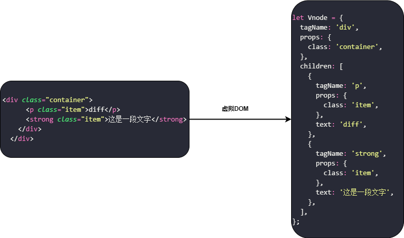
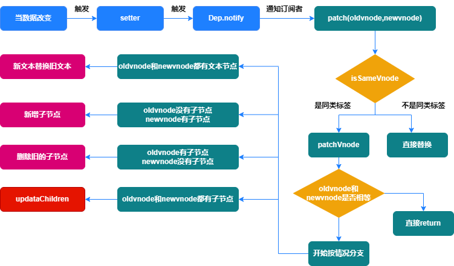
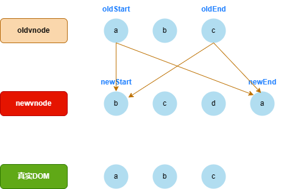
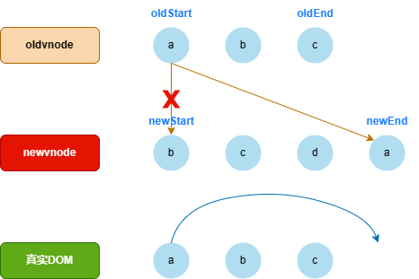
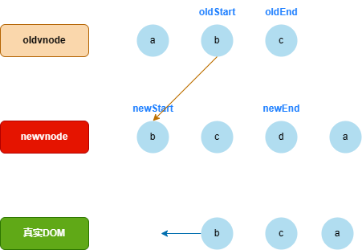
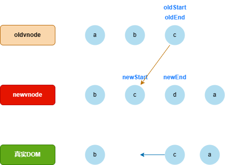
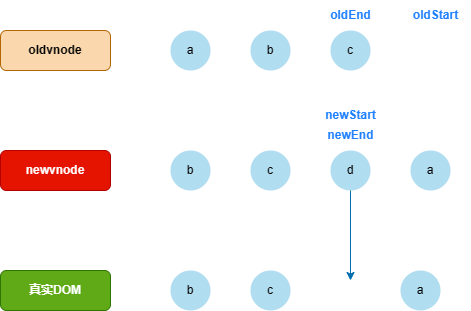
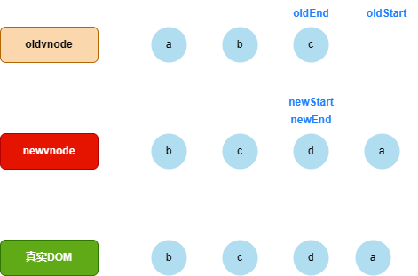

# diff 算法

**想要了解 diff 算法，需要认识一下虚拟 DOM，那么虚拟 DOM 是什么？**

`虚拟DOM`就是表示真实 DOM 的 JS 对象！

> **如果我们修改了文本内容，就会生成一个新的虚拟 DOM，如果能快速找到新旧 JS 之间差异，就可以最小化的更新视图。**

因此内部提供了一个算法，就是`diff`算法，它的目的就是找出差异，最小化更新视图，具体流程如下：

我们看到，如果在新旧节点都有子节点的时候，就进入了另外一个方法，`updataChildren`

**updataChildren**

> 如果我们想从左边的 DOM 结构变成右侧的 DOM 结构，如何最小化的更新 DOM

> 我们在内部定义了只在同级做对比，减少对比次数，最大化的提高对比性能

> 比较规则

1. 依次比较，当比较成功后退出当前比较；
2. 渲染结果以 newVnode 为准；
3. 每次比较后 start 点和 end 点向中间靠拢；
4. 当旧节点中有一个 start 点跑到 end 点右侧时终止比较；
5. 如果都匹配不到，则旧虚拟 DOM key 值去比对新虚拟 DOM 的 key 值，如果 key 值相同则复用，并移动到新虚拟 DOM 的位置；

**第一次比较**

- oldStart 和 newStart 对比，发现并不相同；
- 接着 oldStart 和 newEnd 比较，发现相同；
- 因为所匹配新 DOM 位置在最后，所以真实 DOM 位置也应移动到新 DOM 所处位置；

**第二次比较**

- 接上次匹配，oldStart 和 newEnd 匹配成功，所以 oldStart 向右移动，newEnd 向左移动；
- 开始匹配，oldStart 和 newStart 比较，发现相同；
- 因为所匹配新 Dom 位置在第一个，所以真实 DOM 位置也应移动到新 DOM 所处位置；

**第三次比较**

- 接上次匹配，oldStart 和 newStart 匹配成功，所以 oldStart 向右移动，newStart 也向右移动；
- 开始匹配，oldStart 和 newStart 比较，发现相同；
- 移动规则不变；

**第四次比较**

- 接上次匹配，oldStart 和 newStart 匹配成功，所以 oldStart 向右移动，newStart 也向右移动，此时我们发现`oldStart`已经超出了匹配范围；
- 匹配暂停，把 newvnode 剩余元素，放入真实 DOM 空位置；
- 匹配结束，退出匹配；
- ps:如果新虚拟 DOM 元素比较少的话，我们就需要删除真实 DOM 中多余的元素;

---

